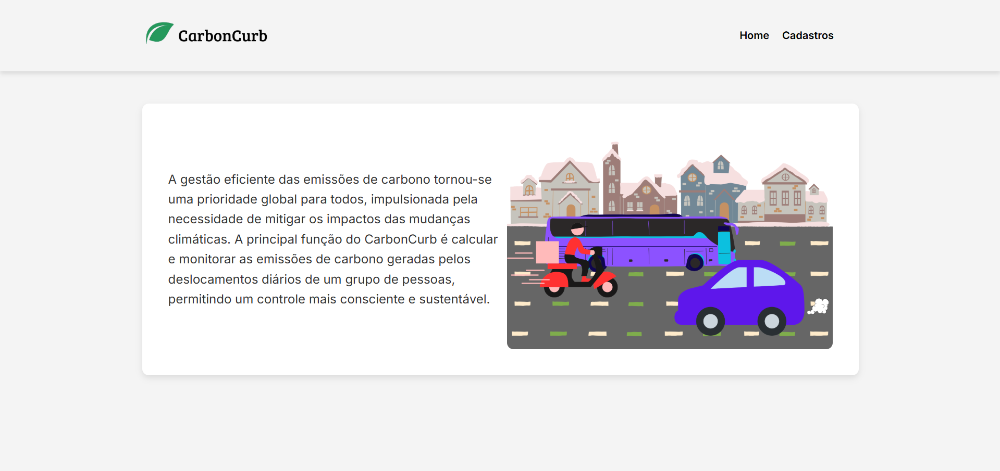
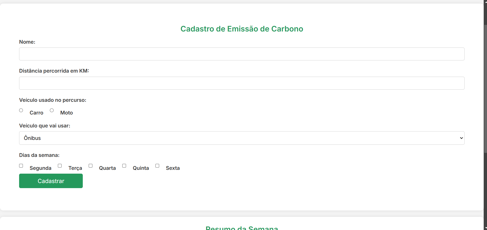
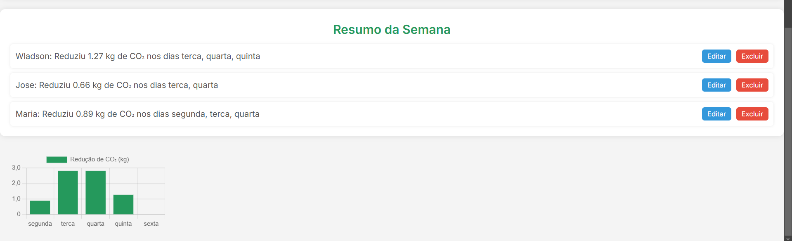

# 🌱 CarbonCurb – Monitoramento de Emissões de Carbono

O **CarbonCurb** é uma aplicação web que calcula e monitora as emissões de carbono geradas pelos deslocamentos diários de um grupo de pessoas. O objetivo é incentivar a adoção de hábitos mais sustentáveis, promovendo uma mobilidade consciente. 🚗🚲🚶‍♂️  

## 📌 Funcionalidades

✅ Registro de deslocamentos diários  
✅ Cálculo automático da emissão de CO₂  
✅ Armazenamento dos dados no **LocalStorage**  
✅ Interface interativa e responsiva    

## 🛠️ Tecnologias Utilizadas

- **HTML5** → Estrutura da aplicação  
- **CSS3** → Estilização e responsividade  
- **JavaScript** → Lógica e interatividade  
- **LocalStorage** → Armazenamento local dos dados  

## 📸 Capturas de Tela  

